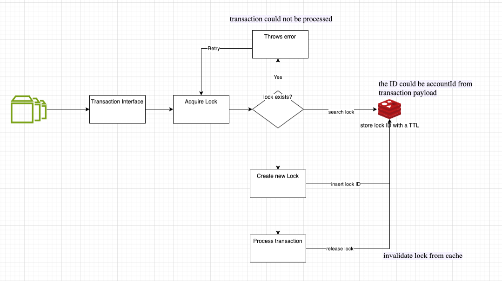

# Tratamento de Transações Simultâneas

Para lidar com transações simultâneas e garantir que apenas uma transação por conta seja processada por vez, podemos utilizar um mecanismo de transaction lock-in e funcionaria da seguinte forma:
Quando uma solicitação de transação chega, o serviço tenta definir um bloqueio (lock-in) no ID da conta (`accountId`) com um TTL curto (para evitar deadlocks em caso de falha do serviço). Se o lock-in for adquirido, a transação será processada imediatamente, caso contrário, o serviço retornará uma resposta de falha. Podemos criar um mecanismo de retry para esse tipo de erro.

## Passos

1. **Adquirir lock-in**: Antes de processar uma transação, verifique se existe um lock-in para o accountId. Se não, crie um novo lock-in e salve-o em cache. Em seguida, vincule o lock-in com o accountId (lockHash#accountId). Isso garante que apenas uma transação possa prosseguir para essa conta por vez.

2. **Processar Transação**: Uma vez que o lock-in é realizado, processe a transação. Isso envolve realizar as operações necessárias para atualizar os saldos da conta e quaisquer outros dados relacionados.

3. **Liberar Bloqueio**: Após processar a transação, libere o lock-in invalidando a chave no cache.

## Benefícios

Usando esta abordagem, você garante que as transações para a mesma conta sejam processadas sequencialmente, prevenindo race conditions e garantindo a consistência dos dados. Este método é particularmente útil em cenários onde as solicitações de transação são síncronas e devem ser processadas rapidamente para evitar timeouts.

## Arquitetura em alto nível da solução de lock-in

